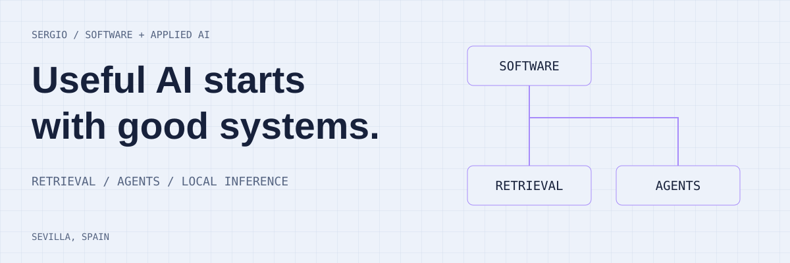

<picture>
  <source media="(prefers-color-scheme: dark)" srcset="assets/banner-dark.svg">
  
</picture>

## Software engineering. Applied AI.

I'm **Sergio Cabeza de Vaca**, an AI Engineer at Cactus based in Sevilla. I work across software development, retrieval systems, local inference and agent workflows.

**[Portfolio and case studies](https://sergio-portfolio-kappa.vercel.app/)** · [Contact](mailto:sergiodev00@gmail.com)

### Systems I work on

| Area | Focus | Public example |
| --- | --- | --- |
| Retrieval | Hybrid search, citations and document ingestion | [Synapse AI](https://github.com/Sergio-CVM00/synapse-ai) |
| Local AI | Local inference and document search | [Local Policy RAG](https://github.com/Sergio-CVM00/local-policy-rag) |
| Machine learning | Histopathology image classification | [CNN-PANDA](https://github.com/Sergio-CVM00/CNN-PANDA) |
| Agent workflows | Planning skills and grounded browser actions | [dev-planning](https://github.com/Sergio-CVM00/dev-planning) · [jev-browser-axi](https://github.com/Sergio-CVM00/jev-browser-axi) |

### Engineering toolkit

**Languages & interfaces:** Python, TypeScript, React, FastAPI 
**Retrieval & agents:** LangGraph, LangChain, ChromaDB, Supabase / pgvector 
**Inference & ML:** Ollama, TensorFlow

More public work

- [Contextual RAG Local](https://github.com/Sergio-CVM00/contextual-rag-local): contextual retrieval running locally.
- [Android Design Skills](https://github.com/Sergio-CVM00/android-design-skills): practical guidance for native interfaces.
- [AI coding workshop](https://github.com/Sergio-CVM00/taller-geo-ia): hands-on teaching materials.

**[See the work in context](https://sergio-portfolio-kappa.vercel.app/)**
